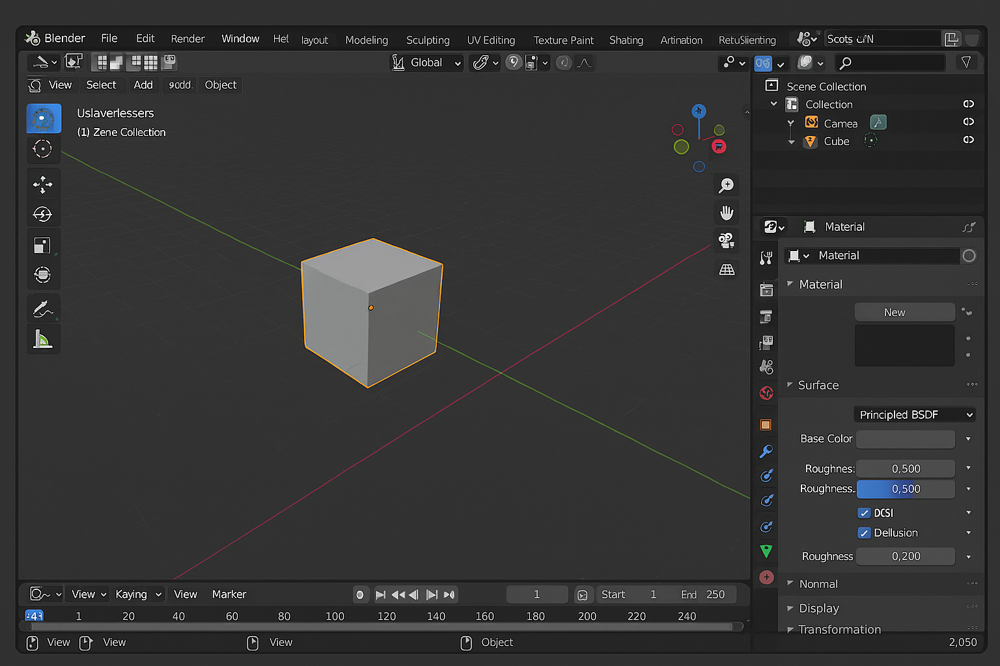

[🏠 Domov](../index.md) · [⬅️ Nahor](./index.md)

# Knowledge Contribution

## Názov
Blender: Základy tvorby 3D modelov

## 🎯 Čo rieši (účel, cieľ)
Ako začať s tvorbou 3D modelov v Blenderi – od inštalácie, cez základné ovládanie, tvorbu objektov, aplikáciu materiálov, až po renderovanie a export.

## 🧩 Ako to rieši (princíp)
Blender je open-source nástroj na 3D modelovanie, animáciu a rendering. Umožňuje vytvárať objekty, meniť ich geometriu, aplikovať textúry a materiály, a exportovať do formátov ako OBJ, FBX alebo GLTF.

## 🧪 Ako to použiť (aplikácia)
- Stiahni a nainštaluj Blender z [blender.org](https://www.blender.org)
- Nauč sa základné ovládanie (viewport, pohyb kamery, výber objektov)
- Vytvor základné objekty (Mesh: Cube, Sphere, Plane)
- Použi modifikátory (Subdivision Surface, Mirror)
- Aplikuj materiály a textúry
- Renderuj scénu a exportuj model

---

## ⚡ Rýchly návod (Top)
1. Stiahni Blender a spusti aplikáciu.
2. Vytvor nový projekt (File → New → General).
3. Pridaj objekt (Shift+A → Mesh → Cube).
4. Použi modifikátor (Properties → Modifier → Subdivision Surface).
5. Nastav materiál (Properties → Material → New → nastav farbu).
6. Renderuj (F12) a exportuj (File → Export → OBJ/FBX).

## 📜 Detailný článok
### 1) Inštalácia a prostredie
- Stiahni Blender z [blender.org](https://www.blender.org/download)
- Ovládanie: Middle Mouse = rotácia, Shift+Middle = posun, Scroll = zoom

### 2) Tvorba objektov
- **Pridanie objektu**: Shift+A → Mesh → Cube/Sphere
- **Transformácie**: G (posun), R (rotácia), S (škálovanie)

### 3) Modifikátory
- Subdivision Surface: vyhladenie objektu
- Mirror: symetria

### 4) Materiály a textúry
- V záložke Material Properties klikni „New“
- Nastav Base Color, Roughness, Metallic

### 5) Renderovanie
- Render Engine: Eevee alebo Cycles
- F12 = render aktuálneho pohľadu

### 6) Export
- File → Export → OBJ, FBX, GLTF

## 💡 Tipy a poznámky
- Používaj klávesové skratky (G, R, S) pre rýchlu prácu.
- Pre realistické osvetlenie použi HDRI mapy.
- Cycles render je pomalší, ale realistickejší.

## ✅ Hodnota / Zhrnutie
Blender poskytuje komplexné nástroje na tvorbu 3D modelov, animácií a vizualizácií. Tento návod pomôže rýchlo začať a vytvoriť prvý model.

---

# 📚 Knowledge Contribution

## 🔖 Názov a stručný popis
Ako vytvárať 3D modely v Blenderi – základné kroky od objektov po render.

## 🗂️ Taxonómia KNIFE
- **Kategória:** 3D Design, Graphics
- **Typ:** Návod
- **Tagy:** Blender, 3D, Modeling, Rendering, Export

## 📜 Obsah
- Inštalácia Blenderu
- Tvorba objektov
- Modifikátory
- Materiály a textúry
- Renderovanie a export

## 🌍 Referencie
- [Blender Official](https://www.blender.org)
- [Blender Manual](https://docs.blender.org/manual/en/latest/)
- [Blender Guru Tutorials](https://www.blenderguru.com)

---

[🏠 Domov](../index.md) · [⬅️ Nahor](./index.md)