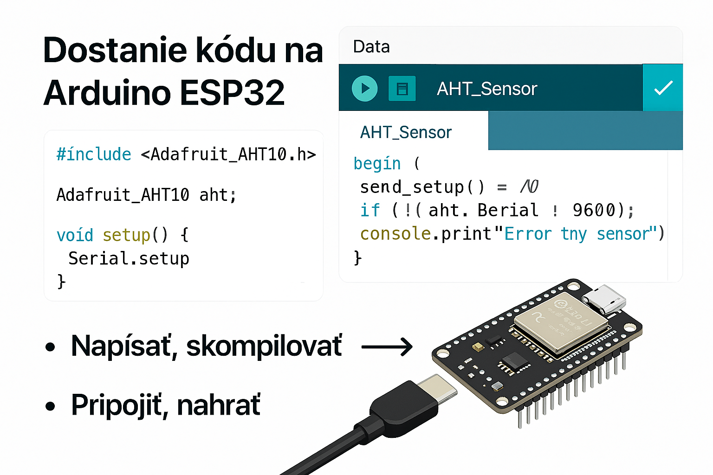

[🏠 Domov](../index.md) · [⬅️ Nahor](./index.md)

# Knowledge Contribution

## Názov
Ako dostať kód na Arduino ESP32: Arduino IDE, čítanie AHT senzora, flashovanie

## 🎯 Čo rieši (účel, cieľ)
Cieľom je ukázať postup, ako napísať a nahrať kód na ESP32 pomocou Arduino IDE, vrátane čítania dát zo senzora AHT (teplota, vlhkosť).

## 🧩 Ako to rieši (princíp)
Používame Arduino IDE na vývoj kódu, knižnicu pre AHT senzor, a USB pripojenie na flashovanie ESP32. Po nahratí kódu ESP32 začne čítať dáta zo senzora a posielať ich do sériového monitoru alebo IoT platformy.

## 🧪 Ako to použiť (aplikácia)
- **Inštalácia Arduino IDE:** arduino.cc
- **Pridanie ESP32 boardu:** V nastaveniach IDE pridať URL `https://dl.espressif.com/dl/package_esp32_index.json`
- **Inštalácia knižnice AHT:** Použi Library Manager → „Adafruit AHTX0“
- **Pripojenie ESP32:** USB kábel, vybrať správny port.
- **Flashovanie:** Klikni „Upload“ v Arduino IDE.

---

## ⚡ Rýchly návod (Top)
1. Nainštaluj Arduino IDE.
2. Pridaj ESP32 board do Board Managera.
3. Nainštaluj knižnicu „Adafruit AHTX0“.
4. Napíš kód na čítanie senzora.
5. Klikni „Upload“ a sleduj výstup v Serial Monitor.

---

## 📜 Detailný článok
### Príklad kódu na čítanie AHT senzora:
```cpp
#include <Wire.h>
#include <Adafruit_AHTX0.h>

Adafruit_AHTX0 aht;

void setup() {
  Serial.begin(115200);
  if (!aht.begin()) {
    Serial.println("AHT senzor sa nenašiel!");
    while (1) delay(10);
  }
  Serial.println("AHT senzor inicializovaný.");
}

void loop() {
  sensors_event_t humidity, temp;
  aht.getEvent(&humidity, &temp);
  Serial.print("Teplota: "); Serial.print(temp.temperature); Serial.println(" °C");
  Serial.print("Vlhkosť: "); Serial.print(humidity.relative_humidity); Serial.println(" %");
  delay(2000);
}
```

### Flashovanie:

Vyber správny port (Tools → Port).
Klikni „Upload“.
Po nahratí otvor Serial Monitor (115200 baud).





## 💡 Tipy a poznámky

Ak upload zlyhá, stlač „BOOT“ tlačidlo na ESP32 počas flashovania.
Použi externý napájací zdroj pri viacerých senzoroch.
Over, že máš správne zapojený senzor (I2C: SDA, SCL).

## ✅ Hodnota / Zhrnutie
Postup umožňuje rýchle nasadenie ESP32 s AHT senzorom na meranie teploty a vlhkosti.

## 📚 Knowledge Contribution
### 🔖 Názov a stručný popis
Ako nahrať kód na ESP32 a čítať dáta zo senzora AHT.
### 🗂️ Taxonómia KNIFE
- Kategória: IoT, Embedded Systems
- Typ: Návod
- Tagy: Arduino, ESP32, AHT, flashovanie, senzory

## 📜 Obsah
Príspevok obsahuje postup inštalácie, konfigurácie a príklad kódu pre ESP32 s AHT senzorom.

## 🌍 Referencie
- [Arduino IDE](https://www.arduino.cc/en/main/software)
- [ESP32 Board Manager](https://dl.espressif.com/dl/package_esp32_index.json)
- [Adafruit AHTX0 Library](https://github.com/adafruit/Adafruit_AHTX0)

---

[🏠 Domov](../index.md) · [⬅️ Nahor](./index.md)