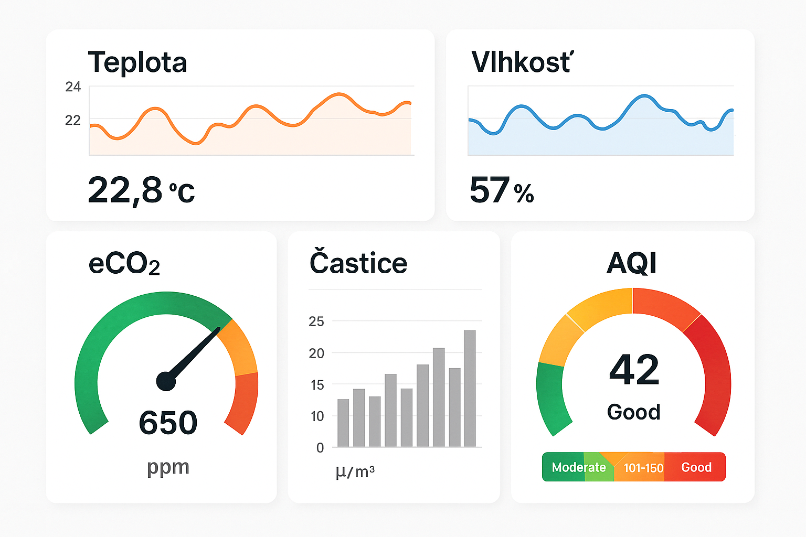

[🏠 Domov](../index.md) · [⬅️ Nahor](./index.md)

# Knowledge Contribution

## Názov
Vizualizácia dát zo senzorov: Teplota, Vlhkosť, Častice, eCO₂, AQI

## 🎯 Čo rieši (účel, cieľ)
Cieľom je prehľadné zobrazenie environmentálnych dát zo senzorov (teplota, vlhkosť, hustota častíc, eCO₂, AQI) pre monitoring kvality vzduchu a podmienok prostredia. Pomáha pri rozhodovaní o ventilácii, filtrácii a optimalizácii vnútorného prostredia.

## 🧩 Ako to rieši (princíp)
Dashboard agreguje dáta zo senzorov cez IoT platformu (napr. MQTT, REST API), ukladá ich do databázy (InfluxDB, PostgreSQL) a vizualizuje pomocou grafov, trendov a KPI indikátorov. Používa farebné kódovanie (napr. AQI stupnica) a alerty pri prekročení limitov.

## 🧪 Ako to použiť (aplikácia)
- **Zber dát:** Senzory merajú teplotu, vlhkosť, PM2.5/PM10, eCO₂, AQI.
- **Prenos dát:** MQTT broker alebo HTTP API.
- **Ukladanie:** Time-series databáza (InfluxDB).
- **Vizualizácia:** Grafana, Power BI alebo custom web dashboard.
- **Alerty:** Nastavenie prahových hodnôt (napr. AQI > 100 = upozornenie).

---

## ⚡ Rýchly návod (Top)
1. Pripoj senzory k IoT platforme.
2. Nastav zber dát do databázy.
3. Vytvor dashboard s grafmi (časové rady, KPI).
4. Implementuj farebné indikátory a alerty.
5. Zdieľaj dashboard s tímom.

## 📜 Detailný článok
Vizualizácia environmentálnych dát je kľúčová pre zdravé prostredie. Dáta ako teplota, vlhkosť a AQI ovplyvňujú komfort aj zdravie. Správne navrhnutý dashboard:
- **Zobrazuje trendy:** Napr. zhoršovanie kvality vzduchu počas dňa.
- **Používa farebné kódovanie:** Zelená = OK, červená = problém.
- **Podporuje rozhodovanie:** Kedy vetrať, zapnúť filtráciu.

## 💡 Tipy a poznámky
- Použi AQI normy (napr. WHO).
- Zobraz min/max hodnoty za posledných 24 hodín.
- Implementuj mobilný prístup (responsive design).

## ✅ Hodnota / Zhrnutie
Dashboard zvyšuje transparentnosť a umožňuje rýchle reakcie na zmeny kvality vzduchu. Zlepšuje zdravie a komfort používateľov.

---

# 📚 Knowledge Contribution

## 🔖 Názov a stručný popis
Vizualizácia dát zo senzorov: Ako sledovať kvalitu vzduchu a prostredia.

## 🗂️ Taxonómia KNIFE
- **Kategória:** IoT, Environment, Data Analytics
- **Typ:** Návod
- **Tagy:** senzory, teplota, vlhkosť, AQI, eCO₂, PM2.5, dashboard

## 📜 Obsah
Príspevok popisuje postupy na zber, spracovanie a vizualizáciu environmentálnych dát zo senzorov.

## 🌍 Referencie
- [Grafana](https://grafana.com)
- [InfluxDB](https://www.influxdata.com)
- [WHO AQI Guidelines](https://www.who.int/news-room/fact-sheets/detail/aqi-guidelines)

---

[🏠 Domov](../index.md) · [⬅️ Nahor](./index.md)