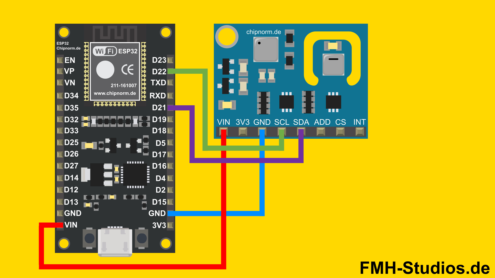

[🏠 Domov](../index.md) · [⬅️ Nahor](./index.md)

# Knowledge Contribution

## Názov
ESP32 + AHT21 + ENS160 (I²C) – kompletný tutoriál zapojenia a čítania dát

## 🎯 Čo rieši (účel, cieľ)
Praktický postup, ako pripojiť kombinovaný senzor **AHT21** pre teplotu/vlhkosť a **ENS160** pre TVOC/eCO₂ k **ESP32**, nainštalovať knižnice v Arduino IDE a nahrať ukážkový kód. Vychádza z návodu FMH Studios a dopĺňa overené zdroje ku knižniciam.

## 🧩 Ako to rieši (princíp)
Senzory komunikujú cez **I²C** (SDA/SCL). AHT poskytne referenčnú teplotu/vlhkosť, ktorú odovzdáme ENS160 pre presnejšiu kompenzáciu. Na ESP32 použijeme Arduino core, knižnice **Adafruit AHTx0** a **ENS160 (Adafruit fork)** alebo **SparkFun ENS160**.

## 🧪 Ako to použiť (aplikácia)
- Zapoj **VIN/3V3, GND, SDA(21), SCL(22)** medzi modul a ESP32.
- V Arduino IDE pridaj **ESP32 Board Manager URL**, nainštaluj **Adafruit AHTx0** a **ENS160** knižnicu.
- Nahraj ukážkový kód, otvor **Serial Monitor** (115200 baud) a sleduj T/RH/TVOC/eCO₂.

---

## ⚡ Rýchly návod (Top)
1. **Arduino IDE → Preferences** → Additional Boards URLs: `https://dl.espressif.com/dl/package_esp32_index.json` → nainštaluj *esp32* balík (Espressif).
2. **Library Manager**: nainštaluj **Adafruit AHTx0** a **ENS160 – Adafruit Fork** (alternatívne **SparkFun ENS160**).
3. Zapoj I²C: **SDA→GPIO21**, **SCL→GPIO22**, **VCC→3V3**, **GND→GND**.
4. Nahraj kód nižšie a otvor **Serial Monitor (115200)**.

## 📜 Detailný článok
### Zapojenie (I²C)
- ESP32 **VIN → VIN** modulu
- ESP32 **GND → GND**
- ESP32 **GPIO21 (SDA) → SDA**
- ESP32 **GPIO22 (SCL) → SCL**

> Poznámka: Na combo moduloch ENS160+AHTxx môže ENS160 mierne zohrievať AHT – zvažuj **teplotný offset** (napr. −5 °C) kalibrovaný podľa reálnych podmienok.



    Zdroj: 
    <a href="https://fmh-studios.de/esp32/co2-sensor-ens160-esp32-tutorial/">
        CO2-Sensor ENS160 – ESP32 Tutorial
    </a>
</img>

### Inštalácia knižníc
- **Adafruit AHTx0** (AHT20/AHT21)
- **ENS160 – Adafruit Fork** *alebo* **SparkFun ENS160** (vyber jednu, priložený kód používa Adafruit fork)

### Ukážkový kód (Arduino)
```cpp
#include <Wire.h>
#include <Adafruit_AHTX0.h>        // AHT20/AHT21
#include "ScioSense_ENS160.h"      // ENS160 (Adafruit fork)

#define I2C_SDA 21
#define I2C_SCL 22

Adafruit_AHTX0 aht;
ScioSense_ENS160 ens160(ENS160_I2CADDR_1); // typická adresa 0x53

void setup() {
  Serial.begin(115200);
  delay(200);
  Wire.begin(I2C_SDA, I2C_SCL);

  if (!aht.begin()) {
    Serial.println("AHT20/AHT21 sa nenašiel. Skontroluj I2C zapojenie.");
    while (1) delay(10);
  }
  Serial.println("AHT inicializovaný.");

  if (!ens160.begin()) {
    Serial.println("ENS160 sa nenašiel. Skontroluj I2C zapojenie.");
    while (1) delay(10);
  }
  Serial.println("ENS160 inicializovaný.");

  // Režim a počiatočná kompenzácia prostredím
  ens160.setMode(ENS160_OPMODE_STD);
  sensors_event_t hum, tmp;
  aht.getEvent(&hum, &tmp);
  ens160.setEnv(tmp.temperature, hum.relative_humidity); // °C, %RH
}

void loop() {
  sensors_event_t humidity, temp;
  aht.getEvent(&humidity, &temp);
  ens160.setEnv(temp.temperature, humidity.relative_humidity);

  uint16_t tvoc = ens160.getTVOC();   // ppb
  uint16_t eco2 = ens160.geteCO2();   // ppm

  Serial.print("T = "); Serial.print(temp.temperature); Serial.print(" °C,  ");
  Serial.print("RH = "); Serial.print(humidity.relative_humidity); Serial.println(" %");
  Serial.print("TVOC = "); Serial.print(tvoc); Serial.print(" ppb,  ");
  Serial.print("eCO2 = "); Serial.print(eco2); Serial.println(" ppm");
  Serial.println("---------------------------");
  delay(2000);
}
```

### Flashovanie na ESP32
- **Tools → Board**: vyber svoj ESP32 (napr. *ESP32 Dev Module*).
- **Tools → Port**: zvoľ správny port.
- Klikni **Upload** a po nahratí otvor **Serial Monitor** (115200 baud).

## 💡 Tipy a poznámky
- Pri problémoch so spojením spusti I²C skener a over adresy (`0x38` pre AHT, `0x53` pre ENS160).
- Ak používaš iný I²C pinout, uprav `Wire.begin(SDA,SCL)`.
- Pre frontend volania pridaj neskôr jednoduchý HTTP server (ESPAsyncWebServer) alebo MQTT.

## ✅ Hodnota / Zhrnutie
Jednoduchý, opakovateľný postup pre ESP32 s kombinovaným **AHTxx + ENS160** modulom: spoľahlivé zapojenie, overené knižnice a funkčný kód, ktorý vracia **T, RH, TVOC, eCO₂** a podporuje kompenzáciu prostredím.

---

# 📚 Knowledge Contribution

## 🔖 Názov a stručný popis
- **Téma:** ESP32 + AHT20/AHT21 + ENS160 – zapojenie a čítanie dát v Arduino IDE.
- **Prečo je dôležitá:** Vnútorná kvalita vzduchu ovplyvňuje zdravie a komfort; kombinovaný senzor prináša praktické metriky (T/RH/TVOC/eCO₂) pre monitoring a automatizáciu.

## 🗂️ Taxonómia KNIFE
- **Kategória:** IoT, Embedded, Senzory
- **Typ:** Návod
- **Tagy:** ESP32, Arduino, I2C, AHT20, AHT21, ENS160, air-quality, TVOC, eCO2

## 📜 Obsah
- Zapojenie I²C, inštalácia ESP32 core a knižníc
- Ukážkový Arduino kód (AHT + ENS160)
- Flashovanie, tipy (offsety, adresy, debug)

## 🌍 Referencie
- [CO2‑Sensor ENS160 – ESP32 Tutorial](https://fmh-studios.de/esp32/co2-sensor-ens160-esp32-tutorial/)
- [ESP32 Arduino IDE (Board Manager URL)](https://fmh-studios.de/esp32/esp32-arduino-ide-erste-schritte/)
- [AHT20 – Arduino guide (knižnica AHTx0)](https://learn.adafruit.com/adafruit-aht20/arduino)
- [ENS160 – Adafruit Fork](https://www.arduinolibraries.info/libraries/ens160-adafruit-fork)
- [ENS160 Arduino Library](https://github.com/sparkfun/SparkFun_Indoor_Air_Quality_Sensor-ENS160_Arduino_Library)

---

[🏠 Domov](../index.md) · [⬅️ Nahor](./index.md)
