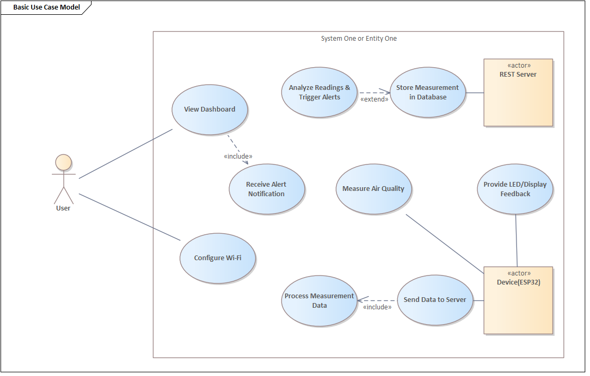

# 01-Business

## Problém
Zvýšená koncentrácia CO₂ a TVOC v interiéroch negatívne ovplyvňuje zdravie, komfort a produktivitu ľudí. Nedostatočné vetranie vedie k únave, zníženej koncentrácii a môže spôsobovať zdravotné problémy.
Dostupné riešenia na trhu sú často drahé, vyžadujú zložitú inštaláciu alebo sú viazané na uzavreté ekosystémy.

## Cieľ projektu
Vyvinúť cenovo dostupné, kompaktné a jednoducho použiteľné zariadenie na monitorovanie kvality ovzdušia, ktoré:

- meria teplotu, vlhkosť, TVOC, eCO₂ a odvodený AQI,
- poskytuje lokálny OLED displej pre okamžitý prehľad,
- umožňuje vzdialený prístup cez webové rozhranie s historickými grafmi.

## Cieľoví používatelia

- Domácnosti – sledovanie kvality vzduchu v obývacích izbách, spálňach.
- Kancelárie – riadenie vetrania podľa koncentrácie CO₂.
- Školy a škôlky – zabezpečenie zdravého prostredia pre deti.
- Malé firmy – monitoring vzduchu v uzavretých priestoroch.

## Prípady použitia

<figure>
  
  <figcaption>Obr.:  Prípady použitia.</figcaption>
</figure>

## Hodnota projektu

- Dostupnosť: nízke náklady, jednoduchá inštalácia, open-source riešenie.
- Prehľadnosť: OLED displej + webová aplikácia (PC & mobil).
- Flexibilita: možnosť rozšírenia o ďalšie senzory alebo funkcie.
- Bezpečnosť: lokálne uloženie dát, žiadne cloudové závislosti.

## Obmedzenia

- Výkon a pamäť ESP32 – nutná optimalizácia kódu.
- Stabilita Wi-Fi pripojenia – závislosť od siete používateľa.
- Presnosť senzorov – vyžaduje kalibráciu pre dlhodobé merania.
- Obmedzený priestor v púzdre – potreba premysleného dizajnu.

## Použitia

- Monitorovanie kvality vzduchu v domácnosti – zlepšenie komfortu.
- Riadenie ventilácie v kancelárii podľa CO₂ – úspora energie.
- Preventívne opatrenia – včasné upozornenie na zhoršenú kvalitu vzduchu.
- Analýza trendov – sledovanie dlhodobých zmien kvality ovzdušia.

<!-- - [Business poznámky](./notes.md) -->

**Navigation:** [⬆️ SDLC](../index.md) · [⬅️ Projekt](../../index.md)
