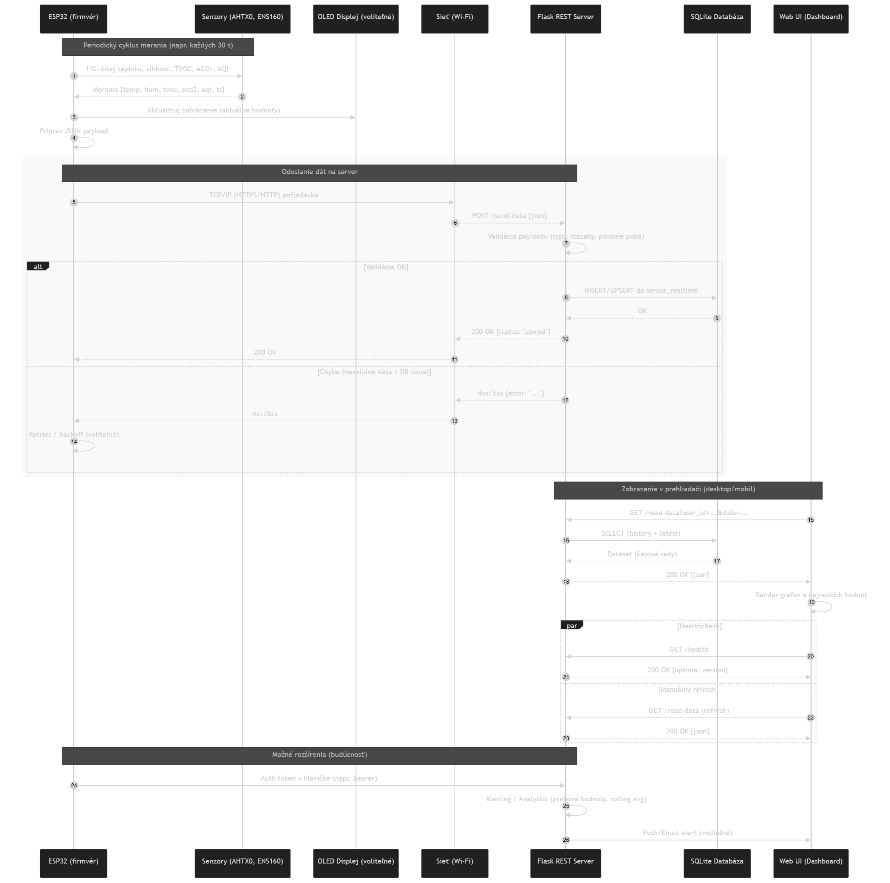

# 03-Solution Architecture

### Popis riešenia

Zariadenie ESP32 je centrálnym prvkom systému.

- Na strane hardvéru:
  - ESP32 komunikuje so senzormi AHTX0 (teplota, vlhkosť) a ENS160 (TVOC, eCO₂, AQI) cez I²C zbernicu.
  - Hodnoty sú zobrazované na OLED displeji (SSD1306) pripojenom cez I²C.

- Na strane softvéru:

  - ESP32 periodicky odosiela namerané dáta cez Wi-Fi na Flask REST API vo formáte JSON.
  - Server vykonáva validáciu dát, ukladá ich do SQLite databázy a poskytuje webové rozhranie pre vizualizáciu (grafy, tabuľky, aktuálne hodnoty).

---

### Kľúčové komponenty riešenia

- ESP32 firmware:
  - Zber dát zo senzorov
  - Zobrazenie na OLED displeji
  - Odosielanie dát cez HTTP POST

- Flask server:
  - REST API endpointy (/send-data, /read-data)
  - Ukladanie dát do SQLite
  - Webová aplikácia (HTML, CSS, JS, Chart.js)

- Databáza SQLite:
  - Tabuľky users a sensor_realtime

- Používateľské rozhranie:
  - Responzívny dashboard (PC & mobil)
  - Historické grafy + aktuálne hodnoty

---

### Vývojový diagram
<figure>
  
  <figcaption>Obr.:  Diagram vizualizuje tok riešenia. Mikrokontrolér číta senzorové dáta a vykresľuje na displej. Zároveň ich zasiela v intervaloch cez sieť na server, kde sa ukladajú do databázy. Dáta si môže používa hocikedy prezrieť z PC alebo mobilu.</figcaption>
</figure>

---

### Sekvenčný diagram

<figure>
  
  <figcaption>Obr.:  Sekvenčný diagram komunikácie medzi ESP32, serverom a používateľom. Zahŕňa cyklus merania, odosielania dát, ukladania do DB a načítania pre vizualizáciu.</figcaption>
</figure>

---

### Tok dát

1. Senzory → ESP32: meranie teploty, vlhkosti, TVOC, eCO₂, AQI
2. ESP32 → Server: odosielanie dát cez HTTP POST (JSON)
3. Server → SQLite: ukladanie dát do databázy
4. Web UI → Používateľ: vizualizácia dát (aktuálne hodnoty + historické grafy)

<!-- - [Solution design](./design.md) -->

**Navigation:** [⬆️ SDLC](../index.md) · [⬅️ Projekt](../../index.md)
