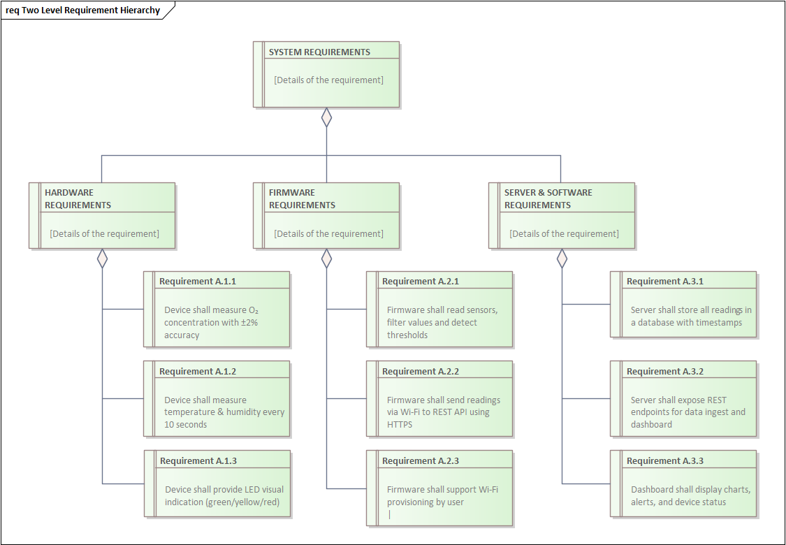

# 04-Analysis

## Analýza problému
Cieľom projektu je vytvoriť zariadenie na monitorovanie kvality ovzdušia, ktoré bude:
- cenovo dostupné,
-- jednoduché na inštaláciu,
- poskytne používateľovi prehľadné dáta v reálnom čase aj historické trendy.

Riešenie musí byť vhodné pre domáce prostredie, kancelárie, školy a malé firmy.
Problém, ktorý riešime:
- Nedostatočné vetranie vedie k zvýšenej koncentrácii CO₂ a TVOC, čo znižuje komfort, zdravie a produktivitu.
- Existujúce riešenia sú drahé, komplikované alebo viazané na uzavreté ekosystémy.

## Diagram požiadaviek

<figure>
  
  <figcaption>Obr.:  Diagram požiadaviek.</figcaption>
</figure>

## Funkčné požiadavky

- Zariadenie musí merať:
  - teplotu, vlhkosť, TVOC, eCO₂ a odvodený AQI.
- Musí umožniť:
  - pripojenie k Wi-Fi a odosielanie dát na server.
- Systém musí poskytovať:
  - webové rozhranie (desktop & mobil) na vizualizáciu dát.
- Podpora:
  - historických grafov a aktuálnych hodnôt.
- Možnosť:
  - exportu dát (napr. CSV).

## Nefunkčné požiadavky

- Stabilné pripojenie k Wi-Fi.
- Jednoduchá konfigurácia (plug & play).
- Responzívne a intuitívne UI.
- Bezpečná komunikácia (napr. HTTPS).
- Nízká spotreba energie (ESP32 + senzory).

## Hardvérové obmedzenia

- Použitie ESP32 ako hlavného mikrokontroléra.
- Senzory AHTX0 a ENS160 (I²C).
- Napájanie cez USB (5V).
- Obmedzený výpočtový výkon ESP32.
- Kompaktné púzdro s otvormi pre prúdenie vzduchu.

## Softvérové obmedzenia

- Firmware v Arduino IDE (C++).
- Komunikácia cez HTTP/JSON.
- Server postavený na Python Flask + SQLite.
- Obmedzená pamäť ESP32 → nutná optimalizácia kódu.
- Spracovanie dát na strane servera (agregácie, grafy).

## Cenová analýza

- Senzor CO₂ (priame meranie): ~90 € → príliš drahé.
- Senzor ENS160 + AHT21 (eCO₂, TVOC, teplota, vlhkosť): 9,90 €.
- ESP32 DevKit: 7,30 €.
- Káble a príslušenstvo: 3,40 € (balenie 120 ks).
- Celková cena riešenia: približne 20 € (bez krytu).

## Identifikované riziká

- Presnosť meraní závislá od kalibrácie senzorov.
- Možné výpadky Wi-Fi → nutnosť lokálneho zobrazenia na OLED.
- Obmedzený priestor v púzdre → potreba premysleného dizajnu.

<!-- - [Backlog a analýzy](./backlog.md) -->

**Navigation:** [⬆️ SDLC](../index.md) · [⬅️ Projekt](../../index.md)
