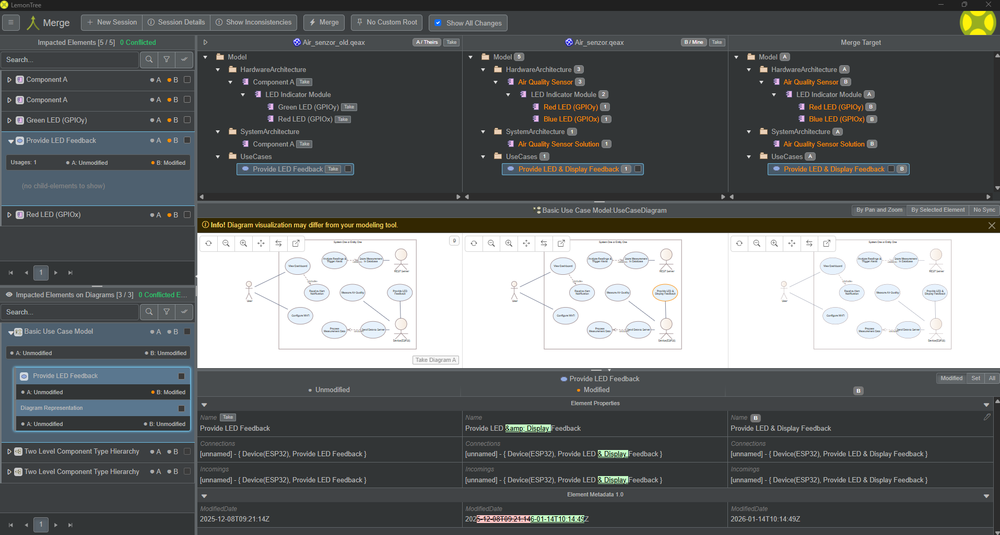

# 09-Change Management

#### Pôvodný návrh
V pôvodnom návrhu projektu Air Quality Monitor sa počítalo s kompletnou implementáciou merania kvality ovzdušia, prenosu dát na server a vizualizácie v prehľadnom webovom rozhraní. Zariadenie malo byť umiestnené v kompaktnom drevenom púzdre, ktoré zabezpečí ochranu elektroniky a jednoduchú manipuláciu.

#### Realizácia
Všetky plánované funkcie boli implementované:

- meranie teploty, vlhkosti, TVOC, eCO₂ a odvodeného AQI,  
- prenos dát cez Wi-Fi na Flask server,  
- ukladanie dát do SQLite,  
- webové rozhranie s historickými grafmi a aktuálnymi hodnotami,  
- voliteľný OLED displej pre lokálne zobrazenie.  

#### Potenciálne zlepšenia

Pre ďalšiu verziu projektu boli identifikované možnosti vylepšenia:

- Sofistikovanejšie Wi-Fi pripájanie
(konfigurácia cez webový portál alebo mobilnú aplikáciu).

- Lepšie uchopenie hardvéru v krabičke (presne vybudované drážky pre ESP32 a senzory, aby boli pevne uchytené a odolné voči pohybu).

- Optimalizovaný prietok vzduchu (ventilačné otvory alebo mriežky, aby sa zabránilo skresleniu meraní spôsobenému uzavretým priestorom).

Implementácia týchto vylepšení by zvýšila presnosť meraní, mechanickú stabilitu a profesionálny vzhľad zariadenia.

## EA & LemonTree

Tieto obrázky zobrazujú proces porovnávania a zlúčenia modelov v nástroji LemonTree, ktorý sa používa na správu verzovania modelov vytvorených v Enterprise Architect (EA). LemonTree umožňuje identifikovať rozdiely medzi dvoma verziami modelu, vizualizovať zmeny a vykonať ich zlúčenie.

<figure>
  
  <figcaption>Obr.: Porovnanie dvoch verzií modelu komponentov. V hornej časti sú zobrazené rozdiely v štruktúre modelu (ľavá verzia vs pravá verzia). V strede je vizualizovaný diagram komponentov, kde sú zmenené prvky zvýraznené. V spodnej časti sú detailné vlastnosti vybraného prvku s označením, čo sa zmenilo.</figcaption>
</figure>

<figure>
  
  <figcaption>Obr.: Porovnanie dvoch verzií Use Case diagramu. LemonTree zvýrazňuje zmenené prvky (napr. názvy prípadov použitia) a umožňuje kontrolu rozdielov v atribútoch. V spodnej časti sú zobrazené konkrétne zmeny v názvoch a vlastnostiach.</figcaption>
</figure>

<figure>
  
  <figcaption>Obr.: Porovnanie modulov v hierarchii komponentov. LemonTree zobrazuje rozdiely v štruktúre modulov a ich vlastnostiach. V spodnej časti sú detailné zmeny atribútov (napr. názvy, typy).</figcaption>
</figure>

<figure>
  
  <figcaption>Obr.: Zlúčenie rozdielov medzi dvoma verziami modelu. V hornej časti sú zobrazené tri stĺpce: pôvodná verzia, upravená verzia a cieľová verzia po zlúčení. V strede je vizualizovaný Use Case diagram s vyznačenými zmenami. V spodnej časti sú detailné informácie o zlúčených vlastnostiach.</figcaption>
</figure>

**Navigation:** [⬆️ SDLC](../index.md) · [⬅️ Projekt](../../index.md)
